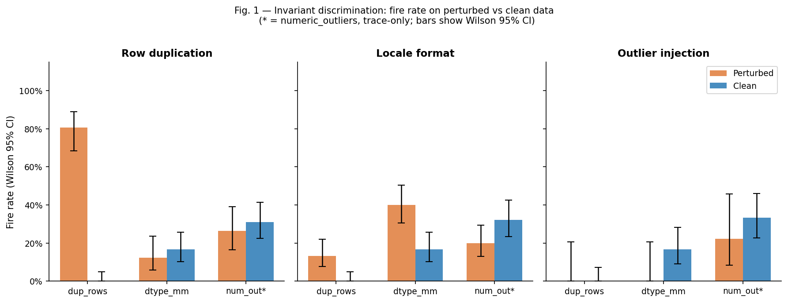
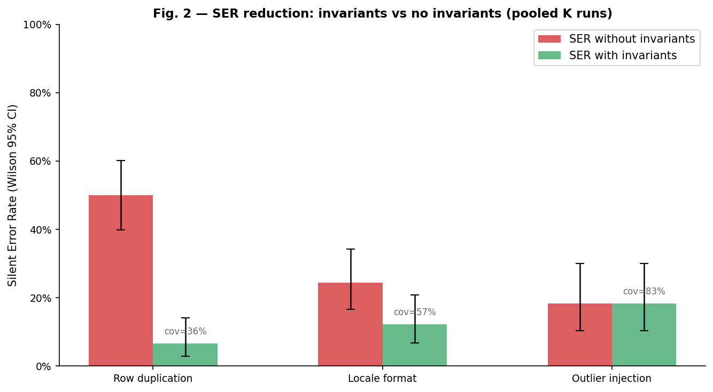
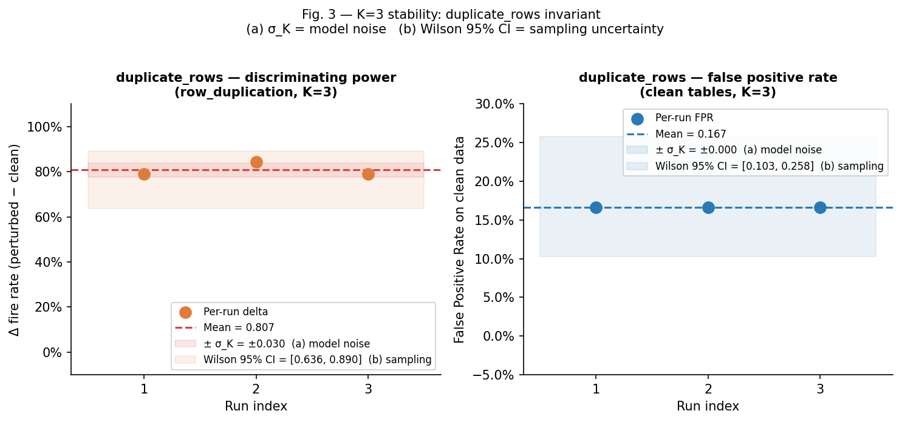

# VERIDATA — Rapport final
## Mesurer la fiabilité vérifiable des agents d'analyse de données

**Auteur** : Sébastien Tamagno
**Modèle évalué** : `claude-sonnet-4-6`, température 0
**Dataset** : DataBench (`cardiffnlp/databench`, split `dev`) — 30 questions `number`
**Date** : 2026-06-06

---

## 1. Résumé

Un agent d'analyse de données peut produire une mauvaise réponse sans le signaler.
Ce silence est plus dangereux qu'une erreur avouée, car l'utilisateur ne sait pas
qu'il doit revérifier.

**VERIDATA** introduit le *Silent Error Rate* (SER) comme métrique principale :
proportion de réponses incorrectes *et* non abstenues. Le SER est distinct de la
précision : une précision de 70 % et un SER de 25 % signifient que sur 100 réponses,
30 sont fausses mais seulement 25 sont livrées silencieusement — 5 ont été
correctement abstenues.

L'approche : instrumenter l'agent avec des *invariants agnostiques à la réponse* —
des contrôles de qualité de données qui détectent des anomalies structurelles dans
les données et le code généré, sans calculer la réponse correcte. Quand un invariant
se déclenche, l'agent s'abstient.

**Résultat phare** : sur une corruption de type duplication de lignes (severity 0.3),
l'invariant `duplicate_rows` atteint un pouvoir discriminant Δ = **+0.807
[IC Wilson 95 % : 0.636 – 0.890]** et — point important — un **taux de faux positifs
de 0 %** sur données propres (0/30). Le SER passe de **50 % à 6.7 %**, mais au prix
d'une **couverture de 35.6 %** seulement : sous la politique d'abstention à trois
invariants, l'agent ne répond qu'à une question sur trois.

Cette faible couverture ne vient pas de `duplicate_rows` (FPR nul) mais des invariants
décisionnels faibles, en particulier `dtype_mismatch` (FPR 16.7 %). Une politique
restreinte à `duplicate_rows` seul donnerait, sur ce mode, un FPR de 0 % et une
couverture de 100 % sur données propres. **Atteindre un SER bas à couverture
acceptable est donc le problème ouvert central** — pas un détail d'industrialisation.

> Réserve statistique majeure : les intervalles ci-dessus reposent sur n = 30 questions
> (et un seul modèle). Le pooling K=3 porte le n nominal à 90, mais le modèle est
> quasi-déterministe à T=0 (27/30 codes identiques entre runs) : le **n effectif reste
> proche de 30**, et les IC Wilson sur n=90 sont donc optimistes. Voir §6.

---

## 2. Méthode

### 2.1 Agent et code-as-reasoning

L'agent reçoit une question et le schéma d'un DataFrame. Il génère du code Python/
pandas stockant la réponse dans la variable `result`, exécuté dans un `exec()` à
builtins restreints (pas d'import, timeout 5 s). L'exécution retourne la valeur de
`result` convertie en chaîne.

### 2.2 Benchmark et prédicat de succès

**Dataset** : `cardiffnlp/databench` — 80 tables réelles issues de Kaggle, ~1822
questions. On retient les 30 premières questions de type `number` (déterministe,
pas de shuffle).

**Perturbation à vérité-terrain connue** : la corruption modifie les *données* mais
ne change pas la réponse correcte. Le prédicat de succès sur données perturbées est :

```
correct_i  ⟺  (réponse ≈ réponse_propre)  OU  (abstained_i = True)
```

Le SER = `mean(not correct AND not abstained)` intègre automatiquement l'abstention.

**Trois modes de perturbation** (severity = 0.3) :

| Mode | Mécanisme | Agrégations sensibles |
|---|---|---|
| `row_duplication` | Duplique 30 % des lignes | sum, count, mean |
| `locale_format` | Convertit les colonnes numériques en chaînes FR (`1 234,56`) | toutes agrégations numériques |
| `outlier_injection` | Injecte des valeurs extrêmes | mean, sum, max |

**Variables collectées** par run vérifié :
- `correct` : comparaison normalisée réponse–vérité (tolérance 1e-4 sur les nombres)
- `abstained` : booléen, recalculé depuis la trace d'invariants
- `invariants` : liste complète des 4 résultats d'invariants (`fired`, `severity`, `detail`)

### 2.3 Invariants agnostiques à la réponse

Un invariant ne calcule jamais la réponse. Il inspecte les données et le code généré
et retourne `fired : bool` + `severity : [0, 1]` + `detail`. Il s'exécute APRÈS
la génération de code mais AVANT de valider la réponse.

**Contrainte anti-confond** : chaque invariant est un contrôle de qualité de données
légitime, justifiable indépendamment du protocole de perturbation.

| Invariant | Condition de déclenchement | Cible perturbation |
|---|---|---|
| `duplicate_rows` | dup_fraction > 5 % ET agrégation sensible dans le code | row_duplication |
| `dtype_mismatch` | colonne référencée non numérique + agrégation numérique | locale_format |
| `unexplained_constant` | literal float en opérande de BinOp (×÷+−), absent des données et de la question | hallucination |
| `numeric_outliers` | valeurs > 5×IQR dans colonnes référencées | — (trace uniquement) |

**Politique d'abstention** : les trois premiers invariants déclenchent l'abstention.
`numeric_outliers` est *trace-only* : sur les tables DataBench réelles, son taux de
déclenchement est similaire sur données propres et perturbées (Δ ≈ 0, IC couvrant
zéro), car un outlier injecté est statistiquement indistinguable d'un outlier réel
(followers Twitter, revenus, scores sportifs).

**Fallback d'indirection** : si l'AST détecte une clé de subscript dynamique
(variable, non littérale), `numeric_outliers` et `dtype_mismatch` élargissent leur
périmètre à toutes les colonnes numériques et l'inscrivent dans le détail.

---

## 3. Positionnement

### Prédiction sélective (*selective prediction*)

VERIDATA s'inscrit dans le cadre de la prédiction sélective : l'agent peut choisir de
s'abstenir plutôt que de répondre. Les métriques employées (SER, coverage, FPR) sont
les métriques standard de ce domaine. La différence avec les approches classiques est
que l'abstention est déclenchée par des invariants *agnostiques à la réponse*, sans
calibration de confiance apprise.

### Distinction avec les outils de qualité de données

Les outils de qualité de données classiques (Great Expectations, dbt tests)
vérifient des **pipelines fixes** : les colonnes testées, les seuils et les règles
sont définis manuellement à l'avance.

Ici, l'agent génère à la volée du code pandas différent pour chaque question. Les
invariants doivent donc **lire le code généré** (AST) pour déterminer quelles
colonnes sont utilisées et quelle agrégation est appliquée — ce qui est impossible
avec un pipeline de qualité statique. C'est le point de différenciation clé, et c'est
aussi là que se situe la contribution la plus originale (cf. l'invariant
`unexplained_constant`, qui classe le rôle des constantes dans le code généré) —
davantage que dans le SER/AURC, hérités de la prédiction sélective.

---

## 4. Résultats

### 4.1 Baseline clean (Semaine 1)

Sur les 50 premières questions DataBench (données propres) :

| Métrique | Valeur |
|---|---|
| Précision | ~98 % |
| SER | ~2 % |

Conclusion : le signal de recherche n'existe pas sur données propres. Les erreurs
silencieuses n'émergent qu'en présence de corruption.

### 4.2 Impact des perturbations sans invariants (Semaine 2, K=1)

| Mode | Précision clean | Précision perturbée (sensibles) | Nature des erreurs |
|---|---|---|---|
| row_duplication | 96.7 % | 21.1 % | Silencieuses |
| outlier_injection | 100 % | 77.8 % | Silencieuses |
| locale_format | 96.7 % | 73.3 % | Majoritairement bruyantes |

La perturbation `row_duplication` crée le signal le plus fort : 78.9 % des questions
sensibles produisent une erreur silencieuse sans invariants.

### 4.3 Tableau de discrimination par invariant — résultat central

Le résultat headline n'est pas un SER agrégé mais **le tableau de discrimination** :
pour chaque invariant, mesure du taux de déclenchement sur données perturbées
(questions sensibles) vs données propres. Le delta est le pouvoir discriminant.

**Métriques rapportées** :
- **(a) σ_K** = variabilité run-à-run sur K=3 (indicative — 3 points). Avertissement :
  90 % des codes sont identiques entre les runs (modèle quasi-déterministe à T=0), σ
  reflète la variabilité résiduelle et non la vraie variance du modèle.
- **(b) IC Wilson 95 %** = incertitude d'échantillonnage sur n questions. **Caveat
  d'indépendance** : avec le pooling K=3, n nominal = 90, mais comme les runs sont
  quasi identiques (27/30 codes égaux), les observations ne sont pas indépendantes ;
  le **n effectif est proche de 30** et les IC ci-dessous sont donc *optimistes*
  (l'intervalle réel est plus large).

#### Mode row_duplication — K=3 (n = 90 poolé, n effectif ≈ 30)

| Invariant | fire_pert | fire_clean | Δ (IC Wilson 95%) | Précision | Rappel | Abstient |
|---|---|---|---|---|---|---|
| `duplicate_rows` | 0.807 ± 0.030 | **0.000 ± 0.000** | **+0.807 [0.636, 0.890]** | 0.849 ± 0.031 | 0.867 | ✓ |
| `numeric_outliers` | 0.263 | 0.311 | -0.048 [-0.248, 0.166] | — | — | ✗ (trace) |
| `dtype_mismatch` | 0.123 | 0.167 | -0.044 [-0.200, 0.133] | — | — | ✓ |
| `unexplained_constant` | 0.000 | 0.000 | 0.000 [-0.049, 0.076] | — | — | ✓ |

**Lecture** : `duplicate_rows` détecte la corruption avec un delta de +0.807, dont la
borne inférieure Wilson est à 0.636 (optimiste — n effectif ≈ 30) — même au pessimisme
statistique, le signal est fort. Surtout, son **taux de déclenchement sur données
propres est nul (0/30)** : il ne produit aucun faux positif. `numeric_outliers` a un
delta négatif (il fire légèrement PLUS sur données propres que perturbées) avec un IC
couvrant zéro → aucun pouvoir discriminant.



#### Mode locale_format — K=3 (n = 90 poolé, n effectif ≈ 30)

| Invariant | fire_pert | fire_clean | Δ (IC Wilson 95%) | Précision | Rappel | Abstient |
|---|---|---|---|---|---|---|
| `dtype_mismatch` | 0.400 ± 0.000 | 0.167 ± 0.000 | **+0.233 [0.047, 0.401]** | 0.222 ± 0.048 | 0.373 ± 0.113 | ✓ |
| `numeric_outliers` | 0.200 | 0.322 | -0.122 [-0.295, 0.061] | — | — | ✗ (trace) |
| `duplicate_rows` | 0.133 | 0.000 | +0.133 [0.027, 0.220] | 0.000 | 0.000 | ✓ |

`dtype_mismatch` discrimine modérément (Δ = +0.233, IC [0.047, 0.401]). La borne
inférieure à 0.047 signale que le résultat est **marginal, voire possiblement
négligeable** avec n = 90 (et n effectif ≈ 30). La précision à 0.222 est faible : le
`dtype_mismatch` fire aussi sur des colonnes object légitimes — c'est lui qui porte
le FPR (cf. §6.2). Cas atypique : `duplicate_rows` fire sur données perturbées (0.133)
mais pas sur données propres — certaines tables locale_format ont des doublons après
conversion.

#### Mode outlier_injection — K=2 (pas de σ, K insuffisant)

| Invariant | Δ (IC Wilson 95%) | Précision | Rappel | Note |
|---|---|---|---|---|
| `numeric_outliers` | -0.111 [-0.375, 0.231] | 0.000 | 0.000 | IC couvre zéro |
| tous les autres | ≈ 0 | — | 0.000 | Non déclenchés |

Aucun invariant ne couvre la classe outlier_injection. Le SER reste identique avec
et sans invariants. C'est la limite assumée et documentée — mais sur n_sensitive = 9
seulement : il s'agit d'une absence de données autant que d'une frontière démontrée.

### 4.4 Réduction du SER par mode

| Mode | SER_sans | SER_avec | Coverage | FPR clean (global) |
|---|---|---|---|---|
| row_duplication | 50.0 % [39.9, 60.1] | **6.7 % [2.8, 14.1]** | **35.6 % [26.4, 45.9]** | 16.7 % [10.3, 25.8] |
| locale_format | 24.4 % [16.7, 34.3] | **12.2 % [6.8, 20.7]** | 56.7 % [46.4, 66.4] | 16.7 % [10.3, 25.8] |
| outlier_injection | 18.3 % [10.4, 30.1] | **18.3 % [10.4, 30.1]** | 83.3 % [71.8, 90.9] | 16.7 % [9.1, 28.2] |

**Lecture** : pour `row_duplication`, le SER passe de 50 % à 6.7 % (réduction de
87 %) **mais au prix d'une couverture de seulement 35.6 %** : l'agent répond à moins
d'une question sur trois. Le SER bas est donc obtenu en grande partie *en ne
répondant pas*. Or ce coût de couverture n'est pas dû à `duplicate_rows` (FPR nul,
cf. §6.2) mais aux invariants faibles de la politique. Pour `outlier_injection`, les
invariants sont inopérants (SER inchangé).



### 4.5 Stabilité K=3 — résultat phare chiffré

Sur les K=3 runs `row_duplication` :

| Métrique | Moyenne ± σ_K (a) | IC Wilson 95 % (b) |
|---|---|---|
| Δ discrimination `duplicate_rows` | **+0.807 ± 0.030** | **[0.636, 0.890]** (optimiste, n eff. ≈ 30) |
| FPR `duplicate_rows` sur clean | **0.000 ± 0.000** | [0.000, 0.114] |
| FPR global (politique 3 invariants) | 0.167 ± 0.000 | [0.103, 0.258] |
| SER avec invariants | 0.067 ± 0.000 | [0.028, 0.141] |
| Coverage | 0.356 ± 0.019 | [0.264, 0.459] |

**(a) σ_K = bruit du modèle** (run-à-run) : σ ≈ 0 confirme que le modèle est
quasi-déterministe à T=0 (27/30 codes identiques entre les runs, distinctness check).
Le σ est indicatif et ne peut être interprété comme un IC. Corollaire : le pooling K=3
n'augmente quasiment pas l'information — le n effectif reste celui d'un run (~30).

**(b) IC Wilson 95 %** = robustesse statistique sur l'échantillon de questions. Le
delta de 0.807 reste fort même à la borne basse (0.636), mais cette borne est
optimiste du fait de la non-indépendance des runs poolés.



---

## 5. Loi dégagée

**Un invariant est efficace si et seulement si sa signature de déclenchement est
structurellement distincte de la variation naturelle des données.**

Concrètement :
- `duplicate_rows` est discriminant parce qu'un dup_fraction > 5 % est statistiquement
  exceptionnel sur une table DataBench propre — il ne s'en produit pas par hasard
  (déclenchement clean : 0/30). La corruption `row_duplication` (30 %) dépasse très
  largement ce seuil.
- `numeric_outliers` est non discriminant parce que les données réelles (Kaggle) ont
  des distributions naturellement extrêmes (followers Twitter, revenus d'entreprise).
  Un outlier injecté est statistiquement indistinguable d'un outlier réel.
- `dtype_mismatch` est modérément discriminant parce que la conversion locale change
  le dtype, mais certaines tables ont déjà des colonnes object (faux positifs — c'est
  l'origine du FPR global).

Corollaire de sélection : la qualité d'un invariant se lit à son **delta de
déclenchement perturbé vs propre**, et un invariant dont le déclenchement sur données
propres est non nul dégrade la couverture sans gain de détection proportionné. Cette
loi fournit un critère a priori pour décider si un invariant candidat mérite d'entrer
dans la politique d'abstention — c'est la contribution méthodologique principale.

---

## 6. Limites

### 6.1 Classe non couverte : sémantique plausible + grounded

Aucun invariant ne couvre la classe d'erreur où l'agent extrait une valeur plausible
d'une source grounded (table de référence correcte, code syntaxiquement juste) mais
erronée pour la question posée. La perturbation `outlier_injection` en est un proxy :
aucun invariant ne détecte les outliers injectés (Δ ≈ 0, IC couvrant zéro). Cette
limite est confirmée empiriquement — mais sur n_sensitive = 9, c'est aussi une
absence de données.

### 6.2 Faux positifs : origine réelle (correction)

Le FPR global sur données propres est de **16.7 % [10.3, 25.8]** pour tous les modes.
Contrairement à ce qu'une lecture rapide suggérerait, il **ne provient pas de
`duplicate_rows`** : sur le run propre `row_duplication`, `duplicate_rows` se déclenche
**0 fois sur 30**, de même que `unexplained_constant`. Le FPR vient **entièrement de
`dtype_mismatch`** (5/30), qui se déclenche sur des colonnes object légitimes des
tables propres.

Conséquence directe et mesurée : une politique d'abstention pilotée par
`duplicate_rows` seul donnerait, sur le mode `row_duplication`, un **FPR de 0 % et une
couverture de 100 % sur données propres**, tout en conservant la détection de la
corruption. La sur-abstention observée (couverture 35.6 %) est donc imputable aux
invariants faibles, pas au bon invariant. **Le problème ouvert central n'est pas
« détecter la corruption » (résolu pour row_duplication) mais « atteindre un SER bas à
couverture acceptable »**, ce qui passe par une politique d'abstention sélective
n'activant que les invariants à FPR nul.

### 6.3 K faible, quasi-déterminisme et n effectif

K=3 répétitions sur un modèle quasi-déterministe à T=0 (27/30 codes identiques) ne
produit pas de σ fiable, et surtout **n'augmente pas réellement la taille
d'échantillon** : les 90 observations poolées équivalent à ~30 observations
indépendantes. Les IC Wilson calculés sur n=90 sont donc optimistes ; les intervalles
réels sont plus larges. Pour gagner en puissance statistique : augmenter le nombre de
*questions* (pas le nombre de répétitions), et tester à température non nulle ou sur
plusieurs modèles pour mesurer la vraie variance.

### 6.4 Petit échantillon et un seul modèle

30 questions, un seul modèle (`claude-sonnet-4-6`), une seule valeur de severity
(0.3). « VERIDATA mesure le SER » est donc à entendre strictement comme « mesure le
SER de Sonnet sur ce sous-ensemble » : aucune généralisation à d'autres modèles n'est
étayée — si `duplicate_rows` fonctionne en partie grâce à la façon dont Sonnet écrit
le code, rien ne garantit la transférabilité. Les IC Wilson sont larges (borne basse
du delta locale_format à 0.047 — résultat marginal). Toute généralisation requiert un
échantillon plus large et plusieurs modèles.

---

## 7. Travaux futurs

### Phase 1 — Consolidation

- **Échantillon élargi** : 100–200 questions, tous types (category, boolean,
  list[number], list[category]) — priorité n°1, car c'est le n des *questions* qui
  resserre les IC, pas les répétitions.
- **Jeu de contrôle à doublons légitimes** : mesurer le FPR réel de `duplicate_rows`
  là où il peut se déclencher à tort (logs, transactions récurrentes) — le 0 % actuel
  n'est valide que sur des tables sans doublon naturel.
- **Séparation agent / invariant** : marquer les questions où l'agent dédoublonne
  spontanément (`nunique`, observé ~4/30) pour ne pas attribuer à l'invariant la
  robustesse de l'agent.
- **Politique d'abstention sélective** : n'activer que les invariants à FPR nul,
  mesurer le couple SER / couverture qui en résulte.
- **Classifieur de constantes** : perturbation dédiée (injection de coefficients dans
  le code attendu) pour évaluer enfin la précision/rappel d'`unexplained_constant`.
- **Multi-modèles** : GPT-4o, Gemini, modèles open-source pour tester la
  généralisation de la loi.
- **K ≥ 10** à température non nulle pour mesurer la vraie variance du modèle.
- **Publication** : article de méthode sur le critère de discriminabilité des
  invariants agnostiques.

### Phase 2 — Invariants et couche produit

- **Invariants métier** : couverture de la classe sémantique (requêtes SQL de
  vérification croisée, contraintes de domaine déclaratives).
- **Seuils adaptatifs** : apprendre le dup_fraction_threshold par table plutôt
  qu'un seuil global, pour réduire le FPR sur tables avec doublons légitimes.
- **Couche produit** : API d'abstention intégrée à un orchestrateur d'agents,
  rapport d'audit par question, tableau de bord coverage / SER en temps réel.

---

## Annexe — Reproductibilité

### Manifests (figés, ne pas régénérer)

```
runs/perturbed/perturbed_row_duplication_0.3_20260606T130903Z/manifest.jsonl
runs/perturbed/perturbed_outlier_injection_0.3_20260606T163034Z/manifest.jsonl
runs/perturbed/perturbed_locale_format_0.3_20260606T163837Z/manifest.jsonl
```

### Commandes de reproduction

```powershell
# Agréger K=3 row_duplication (utilise les runs existants)
python scripts/repeat_runs.py `
  --perturbed `
    runs\verified_row_duplication_0.3_20260606T173652Z.jsonl `
    runs\verified_row_duplication_0.3_20260606T180144Z.jsonl `
    runs\verified_row_duplication_0.3_20260606T180548Z.jsonl `
  --clean `
    runs\verified_clean_0.3_20260606T173759Z.jsonl `
    runs\verified_clean_0.3_20260606T180244Z.jsonl `
    runs\verified_clean_0.3_20260606T180645Z.jsonl

# Générer les figures
python scripts/make_figures.py --out report/figures

# Lancer K nouvelles répétitions (coûte des tokens)
python scripts/repeat_runs.py --manifest runs/perturbed/<id>/manifest.jsonl --k 3
```

### Environnement

- Python 3.11.9
- `anthropic`, `pandas`, `pyarrow`, `matplotlib`, `databench-eval ≥ 4.0`
- `ANTHROPIC_API_KEY` requis pour les runs live (jamais hardcodé)